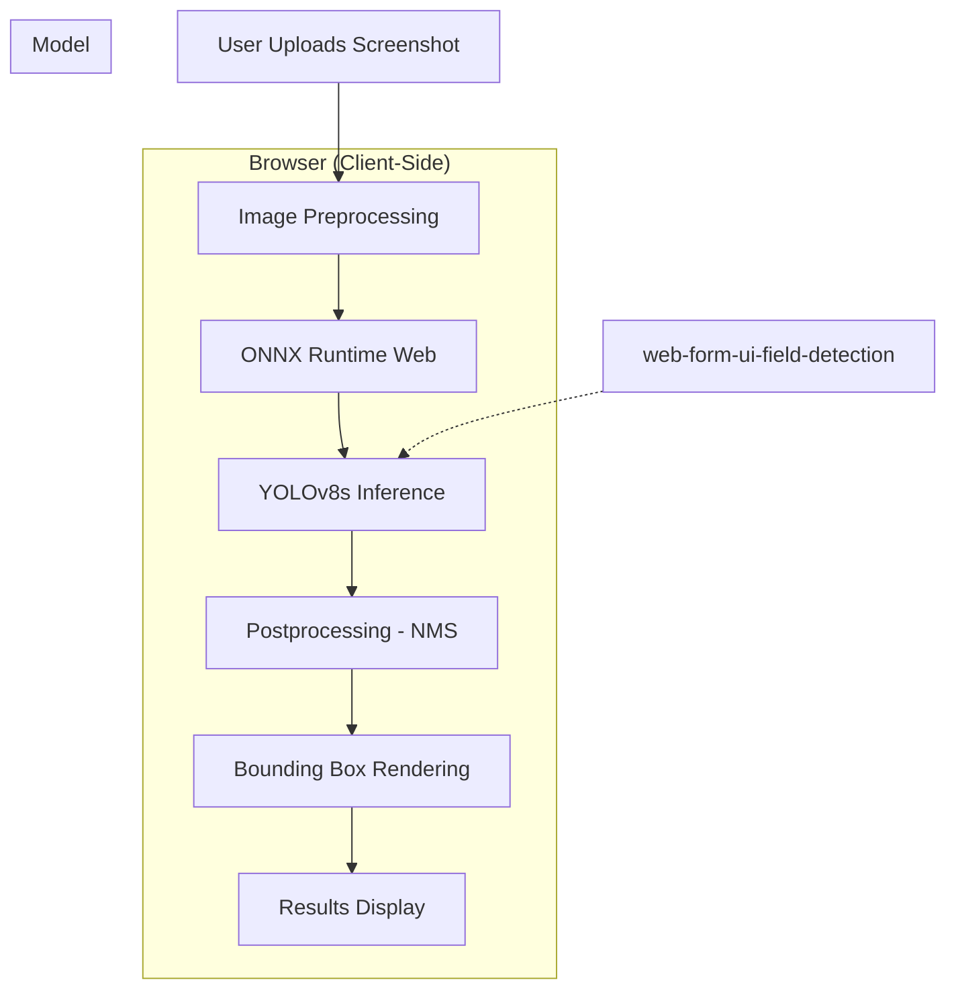
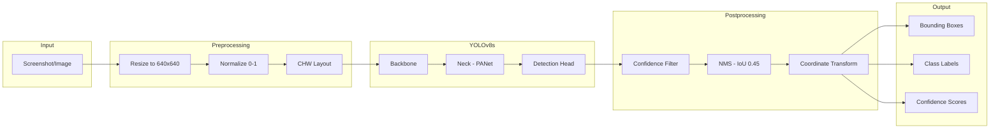
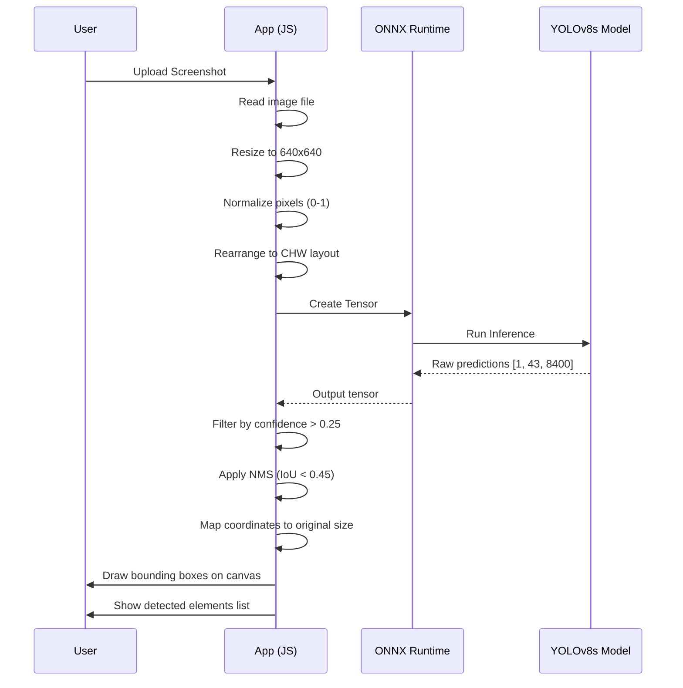
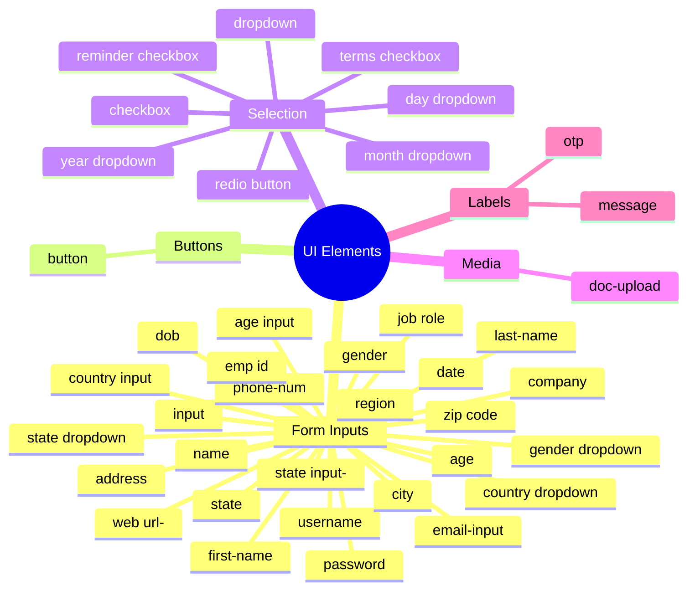
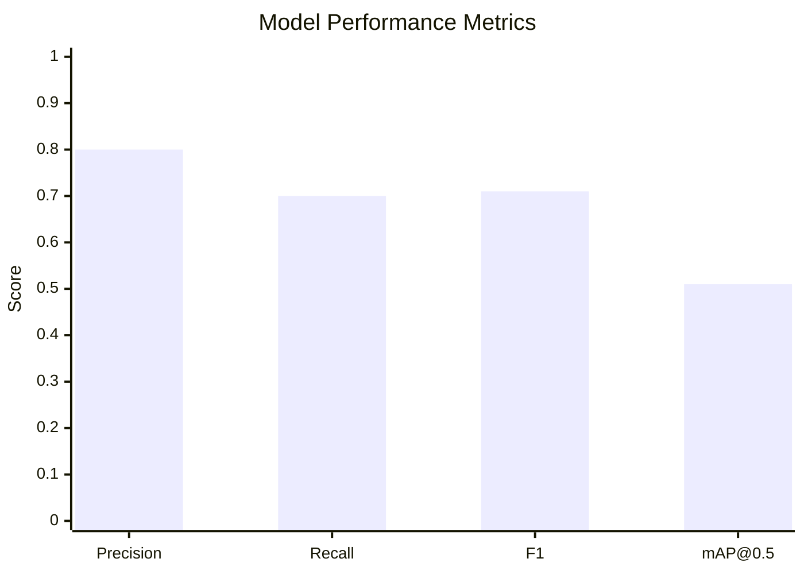

# UI Element Detection - Browser

> Lightweight browser-based UI element detection using [foduucom/web-form-ui-field-detection](https://huggingface.co/foduucom/web-form-ui-field-detection) (YOLOv8s) running entirely client-side via ONNX Runtime Web.

Detect buttons, inputs, dropdowns, checkboxes, radio buttons, text fields, and 39 other UI element types from screenshots - **no server required**.

---

## Demo

```
┌─────────────────────────────────────────────┐
│  [Upload Screenshot]  [Detect]  Conf: 0.25  │
├─────────────────────────────────────────────┤
│                                             │
│    ┌──────┐   ┌─────────────────┐          │
│    │button│   │   text input    │          │
│    └──────┘   └─────────────────┘          │
│                                             │
│    ┌────────┐  ┌─────┐  ┌──────────┐      │
│    │ submit │  │radio│  │ checkbox │      │
│    └────────┘  └─────┘  └──────────┘      │
│                                             │
├─────────────────────────────────────────────┤
│  Detected: 4 elements                       │
│  ● button 95.2%  ● text 88.7%              │
│  ● radio 91.3%   ● checkbox 87.1%          │
└─────────────────────────────────────────────┘
```

---

## How It Works



---

## Architecture



---

## Model Details

| Property | Value |
|----------|-------|
| Architecture | YOLOv8s (Small) |
| Task | Object Detection |
| Input Size | 640x640 RGB |
| Classes | 39 UI element types |
| Precision | 0.80 |
| Recall | 0.70 |
| F1 Score | 0.71 |
| mAP@0.5 | 0.51 |
| Model Size | ~22 MB |
| License | Open |

### Detected Classes

```
DOB, address, age input, age, button, checkbox, city, company,
country dropdown, country input, date, day dropdown, doc-upload,
dropdown, email-input, emp id, first-name, gender dropdown, gender,
input, job role, last-name, message, month dropdown, name, otp,
password, phone-num, redio button, region, reminder checkbox,
state dropdown, state input-, state, terms checkbox, username,
web url-, year dropdown, zip code
```

---

## Project Structure

```
ui-detection-browser/
├── README.md
├── package.json
├── requirements.txt
├── scripts/
│   └── export_model.py          # Export YOLOv8 to ONNX/TFJS
├── model/
│   └── ui-detection.onnx        # Exported ONNX model (after running export)
├── public/
│   ├── index.html               # Browser demo UI
│   ├── css/
│   │   └── style.css
│   ├── js/
│   │   ├── detector.js          # ONNX inference engine
│   │   └── app.js               # UI controller
│   └── server.py                # Local HTTP server
├── docs/
│   └── export.ipynb             # Jupyter notebook for model export
└── .gitignore
```

---

## Quick Start

### 1. Export Model to ONNX

```bash
pip install -r requirements.txt
python scripts/export_model.py onnx
```

This downloads the model from Hugging Face and exports it as `model/ui-detection.onnx`.

### 2. Run in Browser

```bash
cd public
python server.py
# Open http://localhost:8000
```

Or use any static file server:

```bash
npx serve public
```

### 3. Upload a screenshot and click Detect

---

## Export Formats

### ONNX (Recommended for Browser)

```bash
python scripts/export_model.py onnx
```

Uses [ONNX Runtime Web](https://onnxruntime.ai/docs/tutorials/web/) with WebGL/WASM backends.

### TensorFlow.js

```bash
python scripts/export_model.py tfjs
```

Uses [TensorFlow.js](https://www.tensorflow.org/js) with WebGPU/WebGL backends.

---

## How the Pipeline Works



---

## Supported UI Elements



---

## Model Performance



---

## Training Details

| Parameter | Value |
|-----------|-------|
| Base Model | YOLOv8s pretrained |
| Dataset | 600 annotated web form images |
| Optimizer | Adam (lr=1e-4) |
| Loss | mAP loss |
| GPU | NVIDIA RTX 3090 |
| Training Time | ~1 hour |

---

## Browser Compatibility

| Browser | Backend | Status |
|---------|---------|--------|
| Chrome 90+ | WebGL2 | Supported |
| Firefox 90+ | WebGL2 | Supported |
| Safari 15+ | WebGL2 | Supported |
| Edge 90+ | WebGL2 | Supported |

---

## API Reference

### `UIDetector`

The `UIDetector` class (in `public/js/detector.js`) wraps ONNX Runtime Web inference. It is **not to be modified**.

| Method | Description |
|--------|-------------|
| `await loadModel()` | Downloads and loads the YOLOv8s ONNX model into the browser |
| `await detect(image)` | Runs inference on an `HTMLImageElement`, returns raw detections |
| `drawDetections(canvas, image, detections)` | Draws bounding boxes on the canvas |
| `session` | The ONNX Runtime Web inference session (ready after `loadModel`) |
| `confThreshold` | Confidence threshold (default `0.25`) |
| `iouThreshold` | IoU threshold for NMS (default `0.45`) |

**Raw detection object** (from `detector.detect()`):

```js
{
  class: "button",      // detected class name
  classIdx: 0,          // class index
  score: 0.95,          // confidence score
  bbox: { x1: 10, y1: 20, x2: 100, y2: 50 }  // bounding box in original image coords
}
```

### `YoloVisionAdapter`

The `YoloVisionAdapter` (in `public/js/yolo_adapter.js`) converts raw detections into the team contract format.

**Usage:**

```js
const visionOutput = YoloVisionAdapter.adaptDetections(rawDetections);
```

**Adapter output** (team contract format):

```js
{
  id: "ui-1",              // unique sequential ID (ui-1, ui-2, ...)
  type: "button",          // element type (from class field)
  label: "button",         // display label
  bbox: { x1: 10, y1: 20, x2: 100, y2: 50 },  // immutable copy of bbox
  confidence: 0.95         // confidence score
}
```

| Method | Description |
|--------|-------------|
| `adaptDetections(detections)` | Converts raw detections to team contract format; returns sorted array by confidence descending |
| `resetCounter()` | Resets the sequential ID counter (call before each new detection round) |

**Validation rules:**
- Input must be an array; non-array inputs return `[]`
- Each detection must have a valid `bbox` (`x1 <= x2`, `y1 <= y2`) and `score` (`0 <= score <= 1`)
- Invalid detections are filtered out with a console warning
- Output is always sorted by `confidence` descending
- Bounding boxes are shallow-copied (immutable)
- Original `class`, `score`, `classIdx` fields are excluded from output

### `YoloVisionAdapterTestSuite`

The test suite (in `public/js/test_adapter.js`) validates the adapter.

```js
YoloVisionAdapterTestSuite.run()
```

Runs 9 test cases covering basic adaptation, empty input, invalid types, invalid bbox, invalid score, unique IDs, sorting, field mapping, and multiple calls.

### Inference Pipeline

```
User uploads screenshot
  → Image resized to 640×640, normalized (0–1), CHW layout
  → ONNX Runtime Web tensor created
  → YOLOv8s model inference → raw predictions [1, 43, 8400]
  → Confidence filter (> 0.25) → NMS (IoU < 0.45)
  → Coordinate transform to original size
  → YoloVisionAdapter.adaptDetections() → team contract format
  → Results rendered on canvas and in the UI list
```

### Running the Demo

```bash
cd public
python server.py
# Open http://localhost:8000
```

---

## Credits

- Model: [foduucom/web-form-ui-field-detection](https://huggingface.co/foduucom/web-form-ui-field-detection)
- Inference: [ONNX Runtime Web](https://onnxruntime.ai/)
- Architecture: [YOLOv8](https://github.com/ultralytics/ultralytics)

---

## License

MIT
